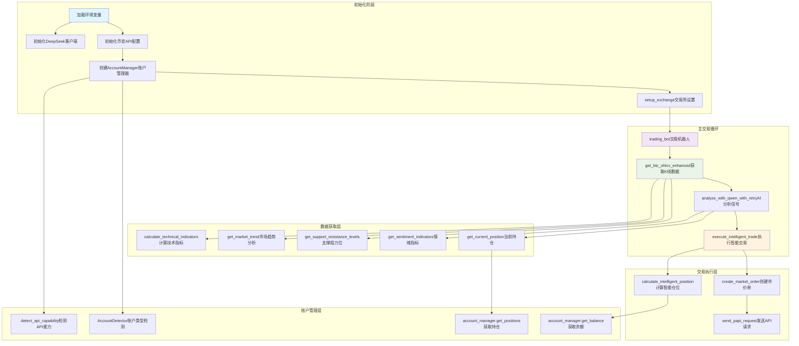
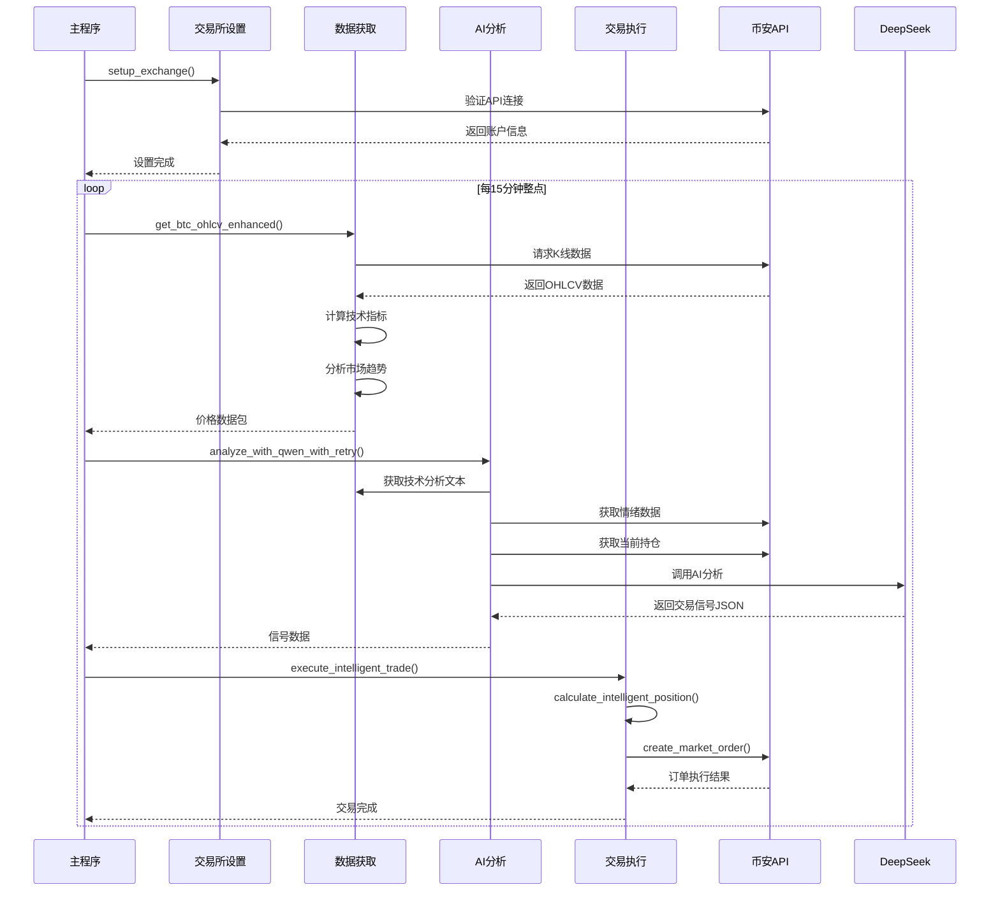

# BTC/USDT 币安自动交易机器人 - 逻辑结构图

## 系统概述
本脚本是一个基于技术分析和AI辅助决策的BTC/USDT自动交易机器人，集成币安统一账户(PAPI)接口，支持实盘和模拟交易。

## 整体架构图



## 详细模块说明

### 1. 核心配置模块
| 模块 | 功能 | 关键变量/类 |
|------|------|------------|
| 环境加载 | 加载API密钥等环境变量 | `load_dotenv()` |
| DeepSeek客户端 | AI分析服务客户端 | `deepseek_client = OpenAI()` |
| 币安API配置 | 统一账户PAPI端点配置 | `BASE_URL = "https://papi.binance.com"` |
| 交易参数配置 | 交易对、杠杆、时间周期等 | `TRADE_CONFIG` 字典 |

### 2. 账户管理模块
| 类名 | 功能 | 主要方法 |
|------|------|----------|
| `ApiCapability`(Enum) | API能力枚举 | PAPI_ONLY, STANDARD |
| `AccountMode`(Enum) | 账户模式枚举 | CLASSIC, UNIFIED |
| `AccountDetector` | 账户类型自动检测 | `detect()` |
| `AccountManager` | 账户抽象层(核心) | `get_balance()`, `get_positions()` |

### 3. 数据获取与处理模块
| 函数 | 功能 | 输出 |
|------|------|------|
| `get_btc_ohlcv_enhanced()` | 获取增强版K线数据 | 包含价格、技术指标、趋势分析的数据字典 |
| `calculate_technical_indicators()` | 计算技术指标 | DataFrame增加SMA、EMA、MACD、RSI、布林带等列 |
| `get_market_trend()` | 市场趋势分析 | 短期/中期趋势、MACD方向、整体趋势判断 |
| `get_support_resistance_levels()` | 支撑阻力位计算 | 静态/动态支撑阻力位及价格相对位置 |
| `get_sentiment_indicators()` | 市场情绪指标 | 乐观/悲观比例、净情绪值 |

### 4. AI信号分析模块
| 函数 | 功能 | 流程 |
|------|------|------|
| `analyze_with_qwen()` | 使用DeepSeek分析市场 | 1. 生成技术分析文本<br>2. 获取情绪数据<br>3. 获取当前持仓<br>4. 构建Prompt调用AI<br>5. 解析JSON信号 |
| `generate_technical_analysis_text()` | 生成技术分析报告 | 格式化技术指标数据为可读文本 |
| `analyze_with_qwen_with_retry()` | 带重试的AI分析 | 失败时重试，最终使用备用信号 |

### 5. 交易执行模块
| 函数 | 功能 | 逻辑 |
|------|------|------|
| `execute_intelligent_trade()` | 执行智能交易 | 1. 获取当前持仓<br>2. 计算智能仓位<br>3. 检查信心程度<br>4. 执行买卖/平仓/调仓操作 |
| `calculate_intelligent_position()` | 计算智能仓位大小 | 基于账户余额、信号信心、趋势强度、RSI状态动态计算 |
| `create_market_order()` | 创建市价单 | 转换交易对格式，调用PAPI下单接口 |

### 6. API通信模块
| 函数 | 功能 | 说明 |
|------|------|------|
| `send_papi_request()` | 发送PAPI请求 | 统一处理签名、headers、请求方法 |
| `generate_signature()` | 生成API签名 | HMAC-SHA256签名算法 |

## 主流程时序图



## 关键数据结构

### 价格数据包 (price_data)
```python
{
    'price': float,                    # 当前价格
    'timestamp': str,                  # 时间戳
    'high': float,                     # 本K线最高
    'low': float,                      # 本K线最低
    'volume': float,                   # 成交量
    'timeframe': str,                  # 时间周期
    'price_change': float,             # 价格变化百分比
    'kline_data': list,                # 最近K线数据
    'technical_data': {                # 技术指标
        'sma_5': float,
        'sma_20': float,
        'sma_50': float,
        'rsi': float,
        'macd': float,
        ...
    },
    'trend_analysis': {                # 趋势分析
        'short_term': str,
        'medium_term': str,
        'overall': str,
        ...
    },
    'levels_analysis': {               # 支撑阻力分析
        'static_resistance': float,
        'static_support': float,
        ...
    },
    'full_data': DataFrame             # 完整DataFrame
}
```

### 交易信号 (signal_data)
```python
{
    'signal': 'BUY|SELL|HOLD',         # 交易信号
    'reason': str,                     # 分析理由
    'stop_loss': float,                # 止损价格
    'take_profit': float,              # 止盈价格
    'confidence': 'HIGH|MEDIUM|LOW',   # 信心程度
    'timestamp': str,                  # 信号时间
    'is_fallback': bool                # 是否备用信号
}
```

## 风险管理逻辑

### 仓位计算公式
```
建议投入USDT = 基础USDT × 信心倍数 × 趋势倍数 × RSI倍数
最终投入USDT = min(建议投入USDT, 账户余额 × 最大仓位比例)
合约张数 = 最终投入USDT / (当前价格 × 合约乘数)
```

### 交易执行规则
1. **信号信心检查**：低信心信号跳过执行（非测试模式）
2. **持仓方向检查**：
   - 信号方向与持仓相反 → 需要高信心才执行反转
   - 信号方向与持仓相同 → 智能调整仓位大小
3. **最小交易量**：确保不低于币安最小交易单位（0.001张）

## 配置文件说明

### TRADE_CONFIG 核心参数
```python
TRADE_CONFIG = {
    'symbol': 'BTC/USDT:USDT',        # 交易对格式
    'leverage': 10,                    # 杠杆倍数
    'timeframe': '15m',               # K线周期
    'test_mode': False,               # 测试模式开关
    'data_points': 96,                # 数据点数(24小时)
    'position_management': {           # 智能仓位管理
        'enable_intelligent_position': True,
        'base_usdt_amount': 100,      # 基础投入金额
        'high_confidence_multiplier': 1.5,
        'medium_confidence_multiplier': 1.0,
        'low_confidence_multiplier': 0.5,
        'max_position_ratio': 10,     # 最大仓位比例(%)
        'trend_strength_multiplier': 1.2
    }
}
```

## 错误处理机制

| 错误类型 | 处理方式 | 降级方案 |
|----------|----------|----------|
| API连接失败 | 重试机制 | 返回None，记录日志 |
| AI分析失败 | 最大重试2次 | 使用备用信号(`create_fallback_signal`) |
| 数据获取失败 | 异常捕获 | 跳过当前周期，等待下一轮 |
| 交易执行失败 | 异常捕获 | 尝试直接开仓，记录详细错误 |

## 环境变量要求
```
DEEPSEEK_API_KEY=sk-xxx          # DeepSeek API密钥
BINANCE_API_KEY=xxx              # 币安API密钥
BINANCE_SECRET=xxx               # 币安API密钥
```

---
*文档生成时间: 2026-01-14*  
*脚本版本: ds3.py (DeepSeek集成版)*